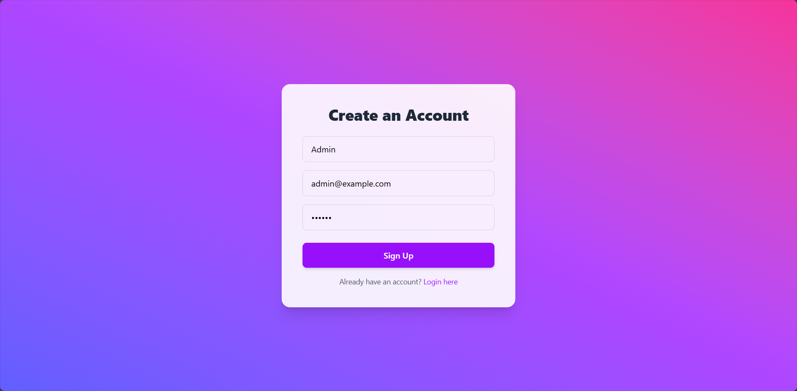
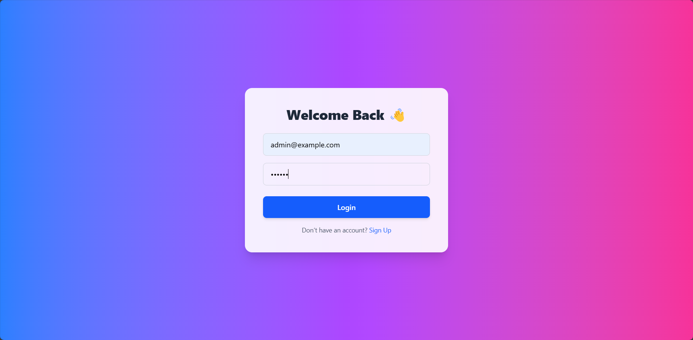
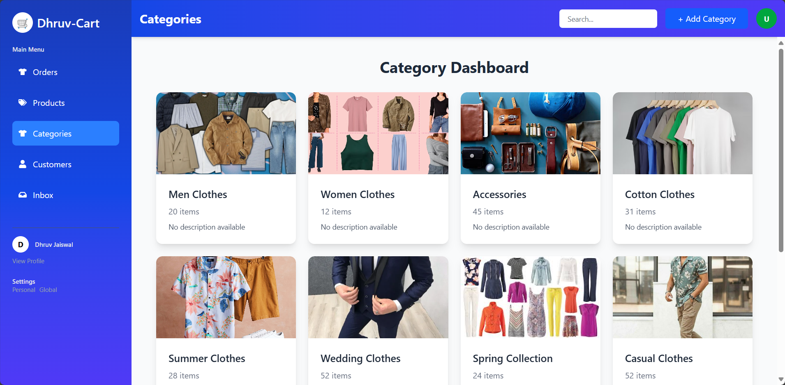
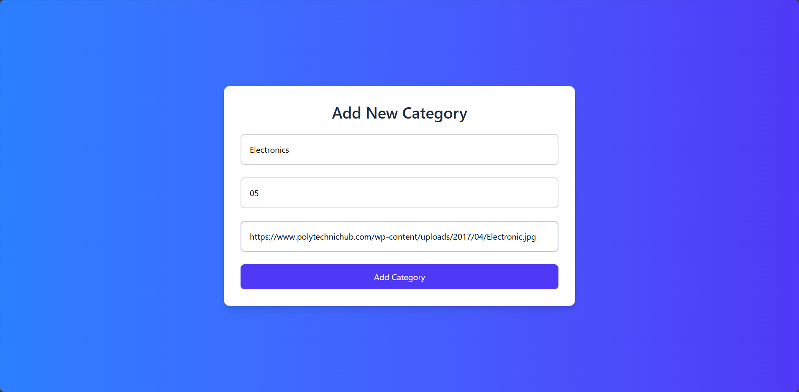

# 🛠️ Category Management Dashboard

- This project is a web application that allows admins to manage categories, sign up, and log in with JWT-based authentication. It has a clean UI with a responsive design, allowing for efficient category management and user authentication.

## Tech Stack

- Backend:
    - Node.js: JavaScript runtime environment for the server-side logic.
    - Express.js: Web framework for building RESTful APIs.
    - SQLite: Database used for storing user and category information.
    - JWT (JSON Web Token): Used for user authentication and token-based security.
    - Bcryptjs: For securely hashing passwords.

- Frontend (Vite + React):
    - React.js: JavaScript library for building the user interface.
    - Tailwind CSS: Utility-first CSS framework for fast UI styling.
    - React Router DOM: For routing between different pages like Login, Signup, and Dashboard.
    - Axios: For making HTTP requests to the backend API.

## Folder Structure:

```bash
    backend/
    ├── database/
    │   └── db.js                # SQLite database configuration
    ├── middleware/
    │   └── auth.js              # Authentication middleware for JWT validation
    ├── routes/
    │   ├── auth.js              # Routes for login and signup
    │   └── categories.js        # Routes for managing categories
    ├── .env                     # Environment variables (JWT_SECRET)
    ├── server.js                # Server entry point to start the app

    frontend/
        |src/
        ├── api/
        │   └── axios.js             # Axios instance for making API requests
        ├── components/
        │   └── CategoryCard.jsx     # Component for displaying a category
        │── layout/
        │       ├── DashboardLayout.jsx  # Layout for the Dashboard page
        │       ├── Sidebar.jsx          # Sidebar component
        │       └── Topbar.jsx           # Topbar component
        ├── pages/
        │   ├── Dashboard.jsx         # Dashboard page displaying categories
        │   ├── Login.jsx             # Login page for admin
        │   ├── Signup.jsx            # Signup page for admin
        │   ├── AddCategory.jsx       # Page for adding a new category
        │   └── EditCategory.jsx      # Page for editing an existing category
        ├── App.jsx                   # Main application component
        ├── main.jsx                  # Entry point for React app
```

## Features

- User Authentication: Admin can sign up and log in using JWT authentication.

- Category Management: Admins can add, edit, and view categories.

- Responsive Design: Fully responsive user interface with Tailwind CSS.

- Protected Routes: Admin routes are protected, ensuring that only authenticated users can access the Dashboard and perform actions.

- Error Handling: User-friendly error handling and validation.

## How to Run Locally

- Steps:

1. Clone the Repository

```bash
git clone https://github.com/dhruvjaiswal2981/Category-Management-Dashboard.git
cd Category-Management-Dashboard
```

2. Install Dependencies
- In both backend and frontend folders:
```bash
npm install
```

3. Setup Environment Variables
- Create a .env file in the backend/ directory and add the following:
```bash
JWT_SECRET=your-secret-key-here
```
- This JWT_SECRET will be used to sign JWT tokens for authentication.

4. Start the Backend Server
```bash
cd backend
node server.js
```
- This will start the backend server on http://localhost:5000 (you can change the port if required).

5. Start the Frontend Server (React + Vite)
```bash
cd frontend
npm run dev
```
- 🌐 Vite dev server runs at: http://localhost:5173

6. Access the Application
- Once both servers are running, open your browser and go to http://localhost:5173. You can:
- Log in to the application via the Login page.
- Sign up via the Signup page.
- Access the Dashboard once logged in.

## Testing

- You can test the application by:
    1. Signing up with a new admin user.
    2. Logging in with the same credentials.
    3. Adding/editing categories from the Dashboard.

- Example API Endpoints

    - POST /auth/signup: Sign up with email and password.
        ```json
            {
            "email": "admin@example.com",
            "password": "123456"
            }
        ```
    - POST /auth/login: Log in and receive a JWT token.
        ```json
            {
            "email": "admin@example.com",
            "password": "123456"
            }
        ```
    - GET /categories: Get the list of all categories.

    - POST /categories: Add a new category (authenticated).
        ```json
            {
            "name": "Electronics",
            "itemCount": 5,
            "imageUrl": "https://www.polytechnichub.com/wp-content/uploads/2017/04/Electronic.jpg"
            }
        ```
    - PUT /categories/:id: Edit a category (authenticated).

## 📸 Screenshots

### 1. 🔐 Signup Page  


---

### 2. 🔐 Login Page  


---

### 3. 🏠 Dashboard  


---

### 4. ➕ Add Category  


---

## 🚀 Deployment

- Backend Deployment
    - Live Demo: The application is hosted on Render
    - Access it here: 

- Frontend Deployment
    - Live Demo: The application is hosted on Netlify.
    - Access it here: 

## Live Demo

- Demo Video Link : 

## 📌 Author

- 💻 Developed by Dhruv Jaiswal
- 🚀 Happy Coding! 🎉
